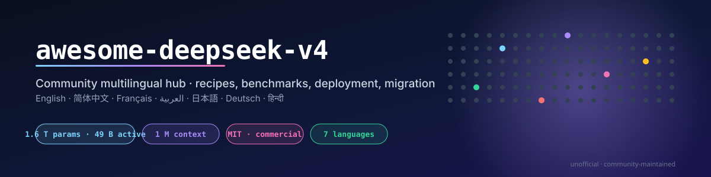

<div align="center">



# awesome-deepseek-v4

**[DeepSeek V4](https://huggingface.co/collections/deepseek-ai/deepseek-v4) の実用的な多言語リソースハブ。**

[](../../LICENSE)
[](../../DISCLAIMER.md)
[](../../CONTRIBUTING.md)
[](https://huggingface.co/collections/deepseek-ai/deepseek-v4)

**🌍 言語を選択**

[English](../../README.md) · [简体中文](../zh-CN/README.md) · [Français](../fr/README.md) · [العربية](../ar/README.md) · [**日本語**](./README.md) · [Deutsch](../de/README.md) · [हिन्दी](../hi/README.md)

</div>

---

## 仕様表

| | **DeepSeek-V4-Pro** | **DeepSeek-V4-Flash** |
|---|---|---|
| 総パラメータ | **1.6 T** MoE | **284 B** MoE |
| アクティブパラメータ | 49 B | 13 B |
| エキスパート（ルーテッド × アクティブ） | 384 × 6 | 256 × 6 |
| コンテキスト長 | 1,000,000 トークン | 1,000,000 トークン |
| 訓練トークン | 33 T | 32 T |
| 精度 | FP4（エキスパート）+ FP8 | FP8 |
| 入力料金 | $1.74 / M tokens | $0.14 / M tokens |
| 出力料金 | $3.48 / M tokens | $0.28 / M tokens |
| ライセンス | MIT · 商用可 | MIT · 商用可 |
| モード | Thinking · Non-Thinking | Thinking · Non-Thinking |

詳細仕様: [docs/architecture.md](../../docs/architecture.md) · ベンチマーク: [docs/benchmarks.md](../../docs/benchmarks.md) · 料金: [docs/pricing.md](../../docs/pricing.md) · 比較表: [docs/comparison.md](../../docs/comparison.md)。

---

## 60秒クイックスタート

V4 は OpenAI ChatCompletions と Anthropic Messages の**両方**のプロトコルに対応。

```python
from openai import OpenAI
client = OpenAI(api_key="sk-...", base_url="https://api.deepseek.com/v1")
resp = client.chat.completions.create(
    model="deepseek-v4-pro",
    messages=[{"role": "user", "content": "√2 が無理数であることを証明してください。"}],
)
print(resp.choices[0].message.content)
```

```python
from anthropic import Anthropic
client = Anthropic(api_key="sk-...", base_url="https://api.deepseek.com/anthropic")
msg = client.messages.create(
    model="deepseek-v4-pro", max_tokens=1024,
    messages=[{"role": "user", "content": "√2 が無理数であることを証明してください。"}],
)
print(msg.content[0].text)
```

詳細: [API クイックスタート](../../getting-started/api-quickstart.md) · [Thinking モード](../../examples/python_thinking_mode.py) · [ツール呼び出し](../../examples/python_tool_calls.py) · [curl](../../examples/curl_basic.sh) · [ローカル vLLM](../../getting-started/local-deployment.md)。

---

## リポジトリ内容

### 入門と移行
- [**API クイックスタート**](../../getting-started/api-quickstart.md)
- [**ローカルデプロイ**](../../getting-started/local-deployment.md) — vLLM / SGLang / transformers
- [**DeepSeek V3 からの移行**](../../getting-started/migration-from-v3.md)
- [**OpenAI からの移行**](../../getting-started/migration-from-openai.md) — 2行変更
- [**Anthropic Claude からの移行**](../../getting-started/migration-from-claude.md) — 2行変更

### リファレンス
- [**ベンチマーク**](../../docs/benchmarks.md)
- [**アーキテクチャ**](../../docs/architecture.md) — CSA+HCA / mHC / Muon / OPD
- [**料金**](../../docs/pricing.md)
- [**比較表**](../../docs/comparison.md)

### 実作業用
- [**レシピ集**](./docs/recipes.md) 🇯🇵 — **コピペで動く10パターン**（コスト見積もり付き）
- [**プロンプトガイド**](../../docs/prompting-guide.md) ⚠️ 英語
- [**ファインチューニング**](../../docs/fine-tuning.md) ⚠️ 英語
- [**FAQ**](./docs/faq.md) 🇯🇵

> *現在、最も価値の高い「レシピ集」と「FAQ」のみ日本語化されています。他の詳細ページは英語のままです — PRでの翻訳協力を歓迎します（[CONTRIBUTING](../../CONTRIBUTING.md) 参照）。*

### リソース
- [公式リンク](../../resources/official-links.md)
- [Awesome コミュニティ](../../resources/awesome-community.md)
- [関連論文](../../resources/papers.md)

### 例
[OpenAI SDK](../../examples/python_openai_basic.py) · [Anthropic SDK](../../examples/python_anthropic_basic.py) · [Thinking](../../examples/python_thinking_mode.py) · [Tool calls](../../examples/python_tool_calls.py) · [curl](../../examples/curl_basic.sh)

### CLI ツール ([`tools/`](../../tools/))
1ファイルの Python CLI。依存は `openai` のみ。
- [**v4-cost-calc**](../../tools/v4_cost_calc.py) — V4 / Claude / GPT / Gemini の月額費用を比較。
- [**v4-migrate-env**](../../tools/v4_migrate_env.py) — 既存プロジェクトの OpenAI/Anthropic 設定を V4 に書き換え。
- [**v4-repo-review**](../../tools/v4_repo_review.py) — リポジトリ全体を V4-Pro に渡して構造化レビューを取得。
- [**v4-chat**](../../tools/v4_chat.py) — ストリーミング対応ターミナル REPL。

### セルフホスト ([`deploy/`](../../deploy/))
自分のハードウェア上で OpenAI 互換エンドポイント。
- [**Docker Compose**](../../deploy/docker-compose.yml) — `docker compose up` 一発。
- [**Kubernetes**](../../deploy/k8s/deployment.yaml) — 本番用 Deployment + Service + ConfigMap。
- [**systemd**](../../deploy/systemd/v4-vllm.service) — ベアメタル用ユニットファイル。

### プロンプトライブラリ ([`prompts/`](../../prompts/))
実戦投入済みのシステムプロンプト。それぞれ推奨モデル・モードを明示。
- コード: [code-reviewer](../../prompts/coding/code-reviewer.md) · [bug-hunter](../../prompts/coding/bug-hunter.md) · [refactor-planner](../../prompts/coding/refactor-planner.md) · [test-writer](../../prompts/coding/test-writer.md)
- エージェント: [coding-agent](../../prompts/agents/coding-agent.md) · [research-agent](../../prompts/agents/research-agent.md) · [planner](../../prompts/agents/planner.md)
- 執筆: [technical-writer](../../prompts/writing/technical-writer.md) · [translator](../../prompts/writing/translator.md)
- 分析: [contract-reviewer](../../prompts/analysis/contract-reviewer.md) · [paper-summarizer](../../prompts/analysis/paper-summarizer.md)
- 教育: [math-tutor](../../prompts/education/math-tutor.md)

---

## コントリビュート

PR 歓迎 — 訂正・翻訳・ベンチマーク再現・コミュニティツール。[CONTRIBUTING.md](../../CONTRIBUTING.md) 参照。

---

## ライセンス

- リポジトリのオリジナルコンテンツ: [MIT](../../LICENSE)
- DeepSeek V4 の重みと技術レポート: MIT, © DeepSeek-AI
- 「DeepSeek」は DeepSeek-AI の商標。本プロジェクトは **DeepSeek-AI とは無関係** です — [DISCLAIMER](../../DISCLAIMER.md) 参照。

---

## メンテナー

**AI小蓝鲸** — 中国のプラットフォームで AI とオープンモデルについて発信しています。全プラットフォームで同じハンドル：

| プラットフォーム | アカウント |
|---|---|
| 📕 Xiaohongshu (小红书) | [AI小蓝鲸](https://www.xiaohongshu.com/search_result?keyword=AI%E5%B0%8F%E8%93%9D%E9%B2%B8&type=54) |
| 📺 Bilibili (B站) | [AI小蓝鲸](https://search.bilibili.com/upuser?keyword=AI%E5%B0%8F%E8%93%9D%E9%B2%B8) |
| 🎵 Douyin (抖音) | [AI小蓝鲸](https://www.douyin.com/search/AI%E5%B0%8F%E8%93%9D%E9%B2%B8) |
| 🎬 WeChat Channels (视频号) | **AI小蓝鲸** (WeChat 内で検索) |

どのプラットフォームからの PR でも歓迎します。

---

<div align="center">

時間の節約になったら ⭐ をお願いします。

</div>
